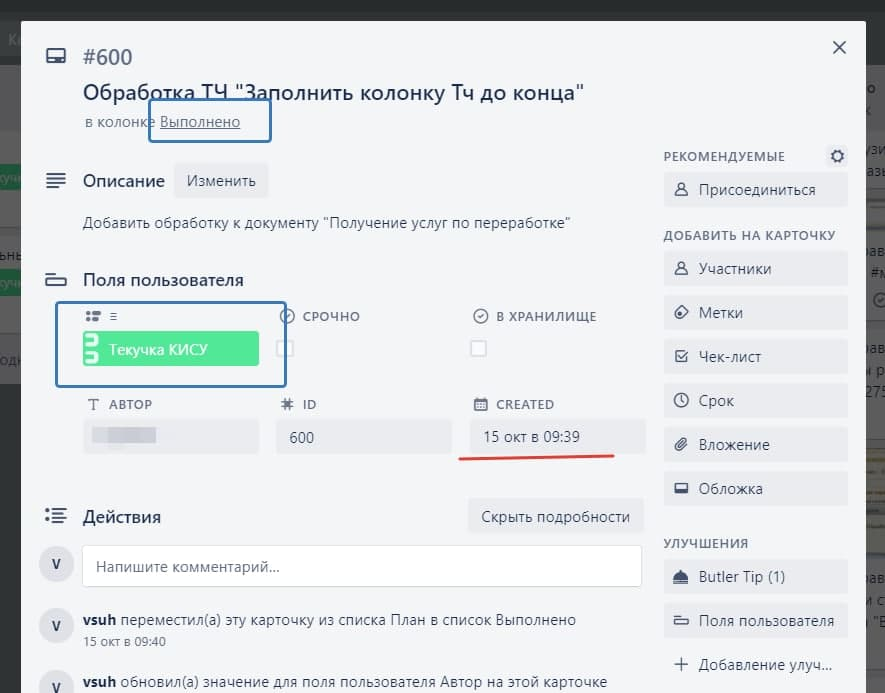

# Манипуляции с карточками в trello

- [Изменение пользовательских полей в карточке](#fieldset)
- [Отчет по карточкам за период](#report)
- [Перенос устаревших карточек (в архив)](#moving)

---

<a name="fieldset"></a>
## _set-custom-field_ - запись значения в пользовательское поле на карточке trello

> Мы ведем в trello свои задачи. Номер карточки используется как номер задачи и записывается в комментарии в коде, в отчеты и т.д. Если выполненные карточки перенести на другую доску (Архив), ее номер переприсваивается в соответствии с нумерацией на архивной доске. Это стало для нас неприятным сюрпризом и несколько номеров задач мы не смогли восстановить. Предлагаемый скрипт позволяет избежать подобной неприятности. Он сохраняет текущий номер карточки (на рабочей доске) в пользовательское поле (Custom field)

Авторизация в организации trello настраивается в модуле `auth`. В этом каталоге нужно создать файл `__init__.py` следующего содержания:

```python
APIKY = '<<<TRELLO-API-KEY>>>'
TOKEN = '<<<ACCESS-TOKEN>>>'
ORGANISATION = '<<<organization>>>'

```

Необходимые значения `api-key` и `token` нужно получить в [trello](https://trello.com/app-key), а id организации можно получить из URL, если кликнуть на имя нужной команды в подменю "КОМАНДЫ" на основной странице [trello](https://trello.com/) после авторизации. У меня он выглядит так: https://trello.com/ **user08081543** /home  
Параметры работы указываются в словаре `dt` в тексте скрипта:

<!-- TODO: обрабатывать список полей -->

```python
dt = {
     'taskname': 'Номер карточки'            - Название задачи
    ,'boardName': "Обслуживание АРПСТН-091" - Название доски
    ,'listName':  "Запланировано"           - Название списка | None
    ,'fieldName': "task-id"                 - Название пользовательского поля
    ,'fieldType': "number"                  - Тип значения пользовательского поля
    ,'chngTempl': "cardId"                  - Шаблон обработки задачи (имя функции)
}

```

Если `listName` не указано, то будут обработаны все (открытые) карточки на доске.  
~~Кстати о типе. Все попытки присвоить значение числовому полю не увенчались. [API](https://developer.atlassian.com/cloud/trello/guides/rest-api/getting-started-with-custom-fields/) упорно возвращал ошибку _400, {"message":"Invalid custom field item value.","error":"ERROR"}_. Как только я изменил [тип значения поля](https://developer.atlassian.com/cloud/trello/rest/api-group-cards/#api-cards-idcard-customfield-idcustomfield-item-put) и, соответственно, запрос с `number` на `text`, ошибки пропали.~~

Описания переменных `trello` можно найти в разделе [Butler](https://help.trello.com/article/1157-variables)


<a name="report"></a>
## _trello-report_ - построение отчета по карточкам trello за период 


при построении отчета используются периоды (`--period`):

- 'cd' | 'pd' текущий или предыдущий день
- 'cw' | 'pw' текущая или предыдущая неделя
- 'cm' | 'pm' текущий или предыдущий месяц
- 'cy' | 'py' текущий или предыдущий год
- 'd' + past=n n-ный день назад
- 'w' + past=n n-ная неделя назад
- 'm' + past=n n-ный месяц назад
- 'y' + past=n n-ный год назад

> при отсутствии параметра `--past` режим соответствует `p?`. Например, указание только параметра `w` без `--past` соответствует режиму `pw` (или `--past 1`)


### Примеры:

```
trello-report.py --period w
trello-report.py --period pw
trello-report.py --period w --past 1
```

список карточек за предыдущую неделю

```
trello-report.py --period m --past 2 
```
Если сейчас октябрь, то список карточек за август

```
trello-report.py --period m --date 20-10-20
```
список карточек за октябрь 2020 г.

```
trello-report.py --date 20-10-20
```
список карточек за 20 октября 2020 г.

Отчет выводится в консоль в формате `tsv`. В первой строке выводятся заголовки колонок.


<a name="moving"></a>
## _move-to-archive.py_ - перенос старых карточек в архив с сортировкой


Скрипт переносит карточки, созданные, более `MESOLD` месяцев назад из списка `LISTNAME` доски `WORKDESK` в список (создается при отсутствии) с именем, указанным в пользовательском поле `UFIELD` карточки, архивной доски `ARCDESK`.

Пример: 
> в списке "Выполнено" на рабочей доске найдена карточка с id=600, попадающая в искомый диапазон даты создания. В результате обработки, эта карточка будет перемещена на доску "Архив" в список "Текучка КИСУ", который будет по необходимости создан.  



|||
|----------:|:---------------|
|`MESOLD`   | = 1            |
|`LISTNAME` | = "Выполнено"  |
|`WORKDESK` | = "Сопровождение ИС"|
|`UFIELD`   | = "**≡**"      |
|`ARCDESK`  | = "Архив"      |

> поле `UFIELD` должно обязательно быть списком строковых значений

